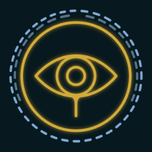

<div align="center">
  
  
  # 🗡️ Hylian OS — Resume 🛡️
  
  [](https://www.typescriptlang.org/)
  [](https://reactjs.org/)
  [](https://tailwindcss.com/)
</div>

A single-page resume for Sage Zora, presented as a Sheikah Slate: the chrome
reads as a device UI, the content reads as a resume.

## ✨ Features

- 🎮 Sheikah Slate shell — status bar, rune rail navigation, boot sequence, scanline overlay
- 📜 Resume-first content: profile, experience, skills, education, selected work, contact
- 📱 Responsive, with the rune rail collapsing to a bottom bar on mobile
- 🎨 Entrance and hover animations using Framer Motion
- 🎯 Particle effects using tsparticles
- 🖨️ Print stylesheet that strips the OS chrome for a clean PDF via Ctrl+P
- ♿ Honors `prefers-reduced-motion`

## 🛠️ Tech Stack

- React 19
- TypeScript
- Vite
- TailwindCSS
- Framer Motion
- tsparticles
- Vitest & React Testing Library

No router, no backend, no environment variables — the whole site is static.

## 🚀 Getting Started

1. Clone the repository:

```bash
git clone git@github.com:sagezaugg/sagezaugg.com.git
cd sagezaugg.com
```

2. Install dependencies:

```bash
npm install
```

3. Start the development server:

```bash
npm run dev
```

4. Open [http://localhost:3000](http://localhost:3000) to view it in the browser.

## 📁 Project Structure

```
src/
  ├── components/
  │   ├── os/          # Slate shell: status bar, rune rail, panels, boot, overlays
  │   └── sections/    # Resume sections
  ├── config/          # Effect toggles (temporary design scaffolding)
  ├── data/            # Resume content and the section registry
  ├── hooks/           # Scroll-position tracking for the rune rail
  ├── assets/          # Textures
  ├── styles/          # Global styles, overlays, print rules
  └── types/           # Resume content types
```

## 🎨 Customization

1. Edit resume content in `src/data/resume.ts` — it is the single source of truth
2. Add or reorder sections in `src/data/sections.ts`
3. Dial the Sheikah treatment up or down with the toggles in `src/config/site.ts`
4. Modify the color scheme in `tailwind.config.js`
5. Configure particle effects in `src/App.tsx`

## 🤝 Contributing

Contributions are welcome! Feel free to submit issues and enhancement requests.

## 📄 License

This project is licensed under the MIT License - see the [LICENSE](LICENSE) file for details.

---

<div align="center">
  <sub>Built with ❤️ by Sage Zora</sub>
</div>
